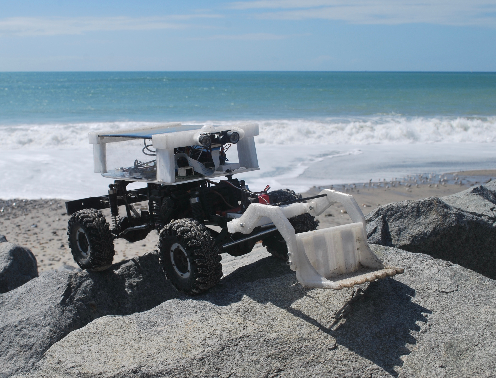

# LitterBug: Autonomous Trash Rover

[](https://travis-ci.org/wroscoe/donkey)
[](https://img.shields.io/pypi/pyversions/donkeycar.svg)

The LitterBug is a trash pick up rover built off the [Donkeycar](https://github.com/wroscoe/donkey) platform. It's goal is to help pick up trash in beaches, parks, etc as well as provide a fun and relevant context for which to learn about self-driving vehicles, AI, and robotics.

#### Read these first!
* [LitterBug Build instructions and Software documentation](https://github.com/mayorquinmachines/LitterBug_donkey/wiki)
* [LitterBug Write-up](https://www.hackster.io/poopityscoop/litterbug-autonomous-trash-rover-765498) (for more details on experiment)



#### Build a LitterBug to:
* Create a version of a real life WALL-E!
* Experiment with autopilots, mapping computer vision and neural networks.
* Train your rover to pick up trash anywhere (..and have fun while saving the planet)
* Log sensor data. (images, user inputs, sensor readings)

### Start Training!
After building a Litterbug, press the select button on the ps3 controller and get rolling.

### Create your own parts.
You can make the LitterBug interact with the environment in new ways by adding a new physical part. For example, this project added a scoop part using an extra servo. 
Since the LitterBug is built off the Donkeycar platform, you can use their structure to create new parts. 

```python
#Define a vehicle to take and record pictures 10 times per second.

from donkeycar import Vehicle
from donkeycar.parts.camera import PiCamera
from donkeycar.parts.datastore import Tub


V = Vehicle()

#add a camera part
cam = PiCamera()
V.add(cam, outputs=['image'], threaded=True)

#add tub part to record images
tub = Tub(path='~/mycar/get_started',
          inputs=['image'],
          types=['image_array'])
V.add(tub, inputs=['image'])

#start the drive loop at 10 Hz
V.start(rate_hz=10)
```

You can also control your new part by mapping an unused button on your PS3 controller. Modifying the donkeycar/parts/controller.py file: 
```python
#AVAILABLE BUTTONS = ['tr', 'tl2', 'tr2', 'mode', 'thumbl', 'thumbr']
#AVAILABLE AXES = ['y', 'z', 'rx']

#In the update() method of the JoystickController class add:

if button == '<AVAILABLE BUTTON HERE>' and button_state == 1:
    #do something!

```
See [LitterBug write-up](https://www.hackster.io/poopityscoop/litterbug-autonomous-trash-rover-765498), [donkeycar resources](http://donkeycar.com),
or join the [Donkeycar Slack channel](http://www.donkeycar.com/community.html) to learn more and share your build.
